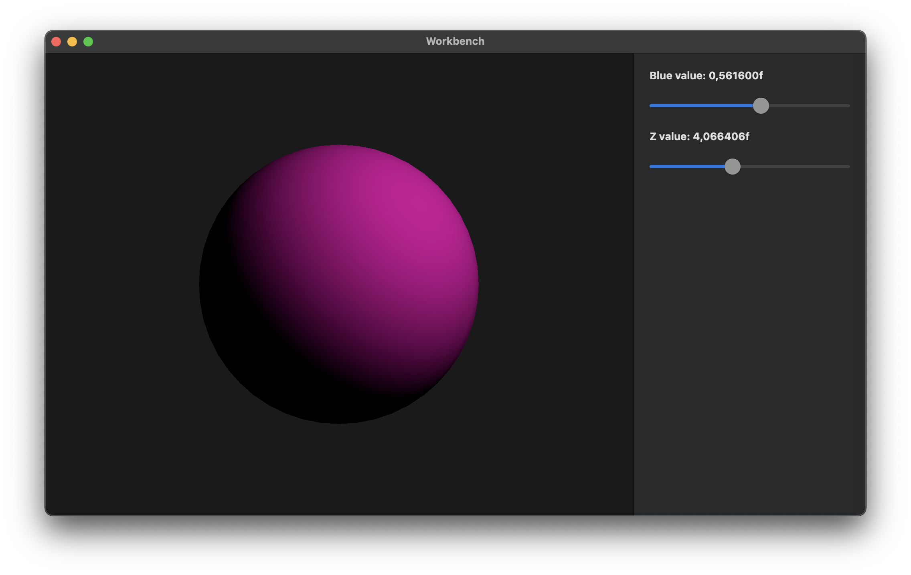

# workbench

A native MacOS app to experiment with the Metal graphics API. Uses SwiftUI for editor interface. Work in progress. Created only for educational purposes.

## License

[GPLv3](LICENSE) © [Asandei Stefan-Alexandru](https://stefan-asandei.netlify.app) 2024.

